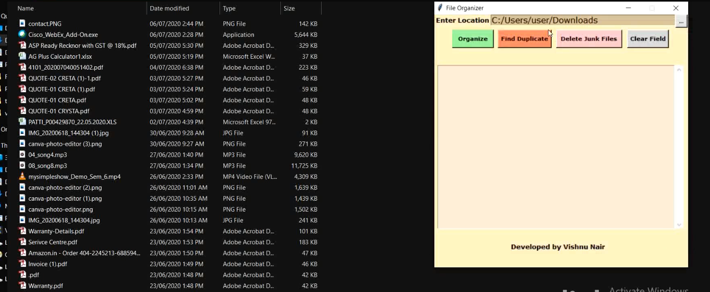

## Welcome to File Organizer

Here's a small project which I started in order to explore Python Programming language and learn about it. 
This is a miniature File Organizer Application which will ease your task of organizing files into corresponding folders based on their file type.
It also provides a feature of removing junk files which you might see in some folders and helps in detecting duplicates as well.

<html>
  <head>
    <!-- Place this tag in your head or just before your close body tag. -->
<script async defer src="https://buttons.github.io/buttons.js"></script>
  </head>
  <body>
    <!-- Place this tag where you want the button to render. -->
<a class="github-button" href="https://github.com/nairvishnu18/File-Organizer/blob/master/Downlaod_File_Organizer.zip" data-color-scheme="no-preference: light; light: light; dark: dark;" data-icon="octicon-download" data-size="large" aria-label="Download ntkme/github-buttons on GitHub">Download</a>
  </body>
  </html>

```markdown
The project is made using Python libraries tkinter , os , shutil.
Here's the snapshots of the application
```
```Before Orgainzing the Folder```


```After Orgainzing the Folder```


```Delete  Confirmation ```


```Finding Duplicates in the Folder```


