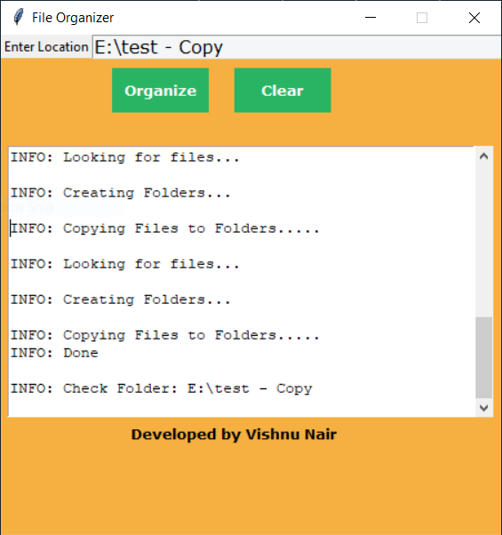
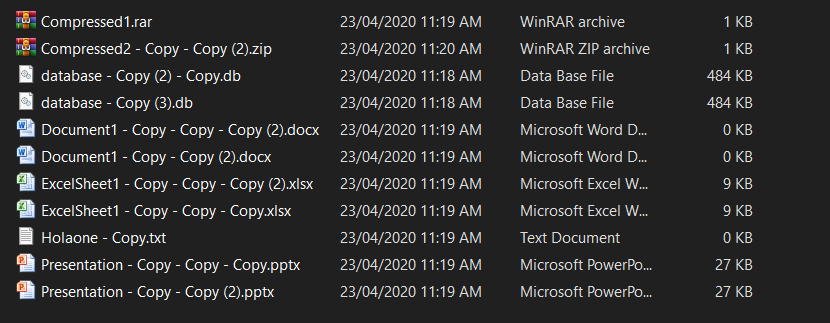
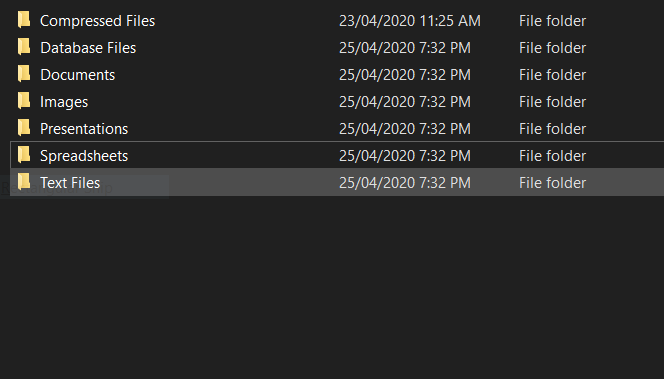

## Welcome to File Organizer

In this article , you will learn about building a simple but efficient file orgainzer that will help in making your boring task of arranging diffeent files into folders.

So Let us get started.

```markdown
Firstly, we don't need many packgaes for building this. We only need the following packages.

1. Tkinter
2. os
3. shutil
```
## Import Modules
```markdown
` 
from tkinter import *
from tkinter.scrolledtext import *
import os
import shutil `
```

## Let us make now the GUI components using tkinter
```markdown
` 
#Root window configuartion
base = Tk()
base.title('File Organizer')
base.geometry("450x450")
base.resizable(width=False, height=False)

#Creating Labels and Buttons 
Label(base,text="Enter Location").grid(row=0)
EntryBox = Entry(base,width="50",bg="#F4F6F7",fg="black",font=("Verdana",12))
base.bind_class("Entry", "<<Paste>>", CopyPaste)

Org_Btn = Button(base, font=("Verdana", 10,"bold"),text="Organize", width="9", height=2,
                     bd=0, bg="#28B463", activebackground="#1A5276", fg='#ffffff'
                 ,command = Organizer)

clear = Button(base, font=("Verdana", 10,"bold"), text="Clear", width="9", height=2,
                     bd=0, bg="#28B463", activebackground="#1A5276", fg='#ffffff',
                     command=clear)


Display_area = ScrolledText(base,width="52",height=15)
Display_area.config(state=DISABLED)

Credits = Entry(base,width="45",bg="#F5B041",borderwidth=0,justify="center",font=("Verdana", 10,"bold"))
Credits.insert(0,"Developed by Vishnu Nair")

#Placing components on the window.
EntryBox.grid(row=0,column=1)
Org_Btn.place(x=100,y=30)
clear.place(x=210,y=30)
Display_area.place(x=6,y=100)
Credits.place(x=6,y=350)
base.configure(bg="#F5B041")
base.mainloop()`
```

## Creating our function 
```markdown
`
def Organizer():
    Display_area.config(state=NORMAL)
    Display_area.delete(1.0, END)
    getpath = EntryBox.get()
    path = getpath.lower()
    files_list = []
  
 **#Dictionary of extensions and their folders**
ext_to_folder = {
              'docx':'Documents','doc':'Documents','ppt':'Presentations','pptx' : 'Presentations', 'pdf' : 'PDF',                                     'exe':'Applications','zip' : 'Compressed Files', 'odt':'Documents',  'txt':'Text Files' ,"xlsx":"SpreadSheets"                           'jpeg':'Images','jpg':'Images','png':'Images','bmp':"Images",'gif':"Images",'avi':"Videos",
              'mp4':'Videos','mvi':"Videos", 'mp3':"Music",'wav':"Music",'rar':"Compressed Files",'tar':"Compressed Files",
             "lnk":"Shortcuts","doc":"Documents", "html":"Web Files(HTML,CSS...)","php":"Web Files(HTML,CSS...)",
              "css":"Web Files(HTML,CSS...)","js":"Web Files(HTML,CSS...)","ico":"Icons","py":"Python Files","ipynb":"Python Files",
              "c":"C Programming Files","java":"Java Programming Files","log":"Log Files",'db':"Database Files","csv":"CSV Files",
              "exe":"Executable Files","msi":"Executable Files",'jar':"Compressed Files",'apk':"Application Packages",                                 "dmp":"System Files", "dll":"System Files","bin":"System Files","url":"Web Files(HTML,CSS...)"
    }
    flag=True
    
    **#Checking whether a path exists or not**
    if not os.path.exists(path):
        flag=False
        if (path == "downloads" or path=="desktop"):
            Display_area.config(state=NORMAL)
            Display_area.insert(END, "\n"+"INFO:"+"Invalid Path => " + getpath)
            Display_area.yview(END)
            Display_area.config(state=NORMAL)
            Display_area.insert(END, "\n"+"INFO:"+r"Try: C:\Users\<username>\Downloads or ...\Desktop")
            Display_area.yview(END)
        else:
            flag=False
            if (path == ""):
                Display_area.config(state=NORMAL)
                Display_area.insert(END, "INFO:"+"Please Specify Path ")
                Display_area.yview(END)
            else:
                flag=False
                Display_area.config(state=NORMAL)
                Display_area.insert(END, "\n"+"INFO:"+"Invalid Path => " + getpath)
                Display_area.yview(END)
                
    else:
        files_list = os.listdir(path)

        
    #File handler
    for files in files_list:
             if '.' not in files:   #For Files without any extension move to Other Files folder
                file_name = files
                folder = "Other Files"
                if(os.path.isdir(path+"/"+file_name)):
                    Display_area.config(state=NORMAL)
                    Display_area.insert(END, "\n" +"INFO: "+ "Checking files.. Folder found " + "\n")

                    Display_area.config(state=NORMAL)
                    Display_area.insert(END, "INFO: "+"Cannot Move a Folder..." + "\n")
                    

                else:
                    if os.path.exists(path + '/' + folder):
                        try:
                            shutil.move(path + '/' + file_name, path + '/' + folder + '/' + file_name)
                             
                        except PermissionError:
                            pass
                    else:
                        try:
                            os.makedirs(path + '/' + folder)
                            shutil.move(path + '/' + file_name, path + '/' + folder + '/' + file_name)
                            
                        except PermissionError:
                            pass
                                     
             else:                                          #For Files with an extension to move specified folders
                    f_name, f_ext = os.path.splitext(files)
                    f_ext = f_ext.strip('.').lower()
                    folder = ext_to_folder.get(f_ext)

                    if folder == None:
                        folder= "Other Files"
                        
                    if os.path.exists(path + '/' + folder):
                         shutil.move(path + '/' + files, path + '/' + folder + '/' + files)
                    else:
                        os.makedirs(path + '/' + folder)
                        shutil.move(path + '/' + files, path + '/' + folder + '/' + files)

                        Display_area.config(state=NORMAL)
                        Display_area.insert(END,"\n"+"INFO: "+ "Looking for files..." + '\n')
                        Display_area.yview(END)
                        Display_area.config(state=NORMAL)
                        Display_area.insert(END, "\n"+"INFO: "+ "Creating Folders..." + '\n')
                        Display_area.yview(END)
                        Display_area.config(state=NORMAL)
                        Display_area.insert(END, "\n"+"INFO: "+ "Copying Files to Folders....." + '\n')
                        Display_area.yview(END)
                        flag=True


                        
            

    if(flag):
        Display_area.config(state=NORMAL)
        Display_area.insert(END,"INFO: "+ "Done"+'\n')
        Display_area.yview(END)
        Display_area.config(state=NORMAL)
        Display_area.insert(END,"\n"+"INFO: "+"Check Folder: "+getpath+'\n')
        Display_area.yview(END)
`
```
## Function for clearing the text fields and allowing copy paste in fields.
```markdown
`
def clear():
    Display_area.config(state=NORMAL)
    Display_area.delete(1.0, END)
    EntryBox.delete(0,END)
    
def CopyPaste(event):
    try:
        event.widget.delete("sel.first", "sel.last")
    except:
        pass
    event.widget.insert("insert", event.widget.clipboard_get())
    return "break"
`
```
## That's IT!!! You can run the file and see the magic in seconds.
## Here's the sample output snapshots
## GUI

## BEFORE ORGANIZING

## AFTER ORGANIZING

