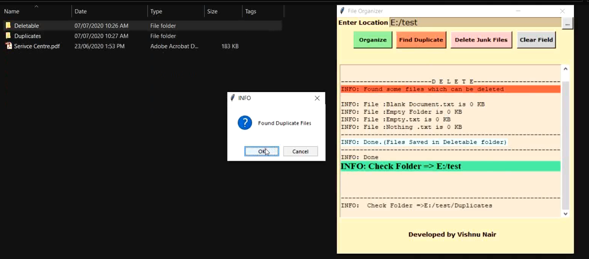

## Welcome to File Organizer

Here's a small project which I started in order to explore Python Programming language and learn about it. 
This is a miniature File Organizer Application which will ease your task of organizing files into corresponding folders based on their file type.
It also provides a feature of removing junk files which you might see in some folders and helps in detecting duplicates as well.


```markdown
The project is made using Python libraries tkinter , os , shutil.
Here's the snapshots of the application
'''




